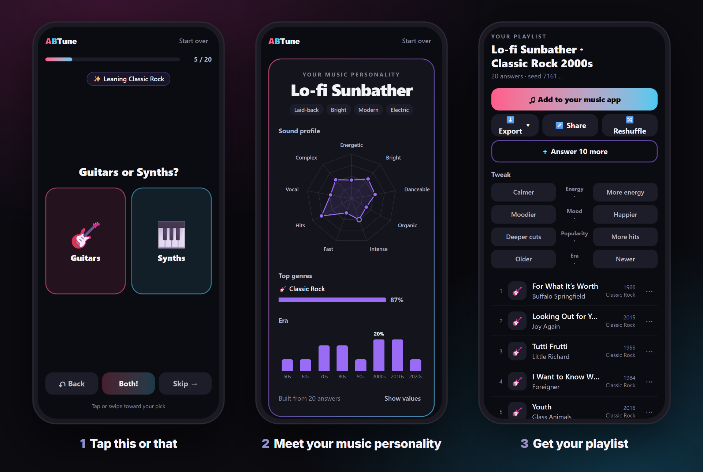

<div align="center">

# ABTune

**A/B test your taste.** Answer a quick run of this-or-that cards and get a playlist that sounds
like you, picked from an open catalog of 2 million songs.

**[Try it at abtune.com →](https://abtune.com)**<br>
No login, no app, about two minutes on your phone.

[](https://github.com/mrdushidush/abtune/actions/workflows/ci.yml)
[](LICENSE)
[](docs/DATA_LICENSES.md)
[](CHANGELOG.md)



</div>

## What it does

- **The quiz.** Pick how deep to go (10, 20, 50 or 100 cards), then tap, swipe or use the arrow
  keys: *Bon Jovi or Britney? 80s or 90s? Road trip or study session?* A hint chip shows what your
  answers say so far, and every session asks a different mix.
- **Your music personality.** One of 16 archetypes, your sound profile (energy, mood, danceability
  and six more), your top genres and your eras.
- **The playlist.** Songs people actually know: each artist's best-known songs first, unless you ask
  for deeper cuts. Tweak it (more energy, moodier, newer…), reshuffle it, add 25 deeper cuts, swap
  a song, or answer 10 more cards to sharpen it.
- **Take it with you.** Add it to Spotify, Apple Music or YouTube Music, export it (M3U, CSV, XSPF,
  JSON), or share a link that rebuilds your card and the exact playlist on any device. The card
  saves as an image for a post or a story.

## How it works

Spotify closed its recommendations and audio-features endpoints to new apps in November 2024, so a
"playlist from your taste" app can't lean on Spotify anymore. ABTune doesn't need it:

1. **An open catalog.** About 2M songs built from public data dumps: MusicBrainz (songs, artists,
   ISRCs, languages, genre tags), ListenBrainz (what people actually listen to) and AcousticBrainz
   (energy, mood, danceability, tempo). The pipeline is in this repo and rebuilds on one PC.
2. **A taste model.** Each answer moves a profile of 9 sound scales, 24 genre clusters, 8 decades
   and 5 languages. The next card is the one that would teach the quiz the most right now.
3. **Deterministic playlists.** The server scores the catalog against your profile, favors songs
   people know, keeps any artist to two songs at most, and orders the list along an energy curve.
   The same answers and seed always give the same playlist, which is why a share link can rebuild
   it exactly. 50 songs take about half a second on a one-vCPU server.

The design is in [docs/HANDOFF.md](docs/HANDOFF.md), and every choice made since, with its reason,
is in [docs/DECISIONS.md](docs/DECISIONS.md).

## Privacy

- **No accounts and no tracking.** The quiz runs in your browser, and your answers never leave it.
- The server gets only the resulting taste profile (a few dozen numbers) to pick songs, and keeps
  no record of it.
- Share links carry the profile in the URL fragment, which browsers don't send to servers.
- abtune.com counts events per day (quizzes started and finished, shares, exports) with no IDs,
  IP addresses or cookies. The counts are public at
  [abtune.com/api/stats](https://abtune.com/api/stats).
- "Add to your music app" copies the song list and opens TuneMyMusic, a free transfer site, where
  you sign in to your app. ABTune sends it nothing.

More in [SECURITY.md](SECURITY.md).

## Run it yourself

You need Docker (Docker Desktop on Windows and macOS).

```sh
git clone https://github.com/mrdushidush/abtune.git && cd abtune
docker compose run --rm catalog   # one time: download and verify the 50k-song dev catalog (8 MB)
docker compose up --build
```

Open <http://127.0.0.1:8787>. A self-hosted install can also save playlists straight into Spotify
through your own Spotify app, and can use a local AI model for a few extras: it reads your answers
together, takes "describe it" tweaks ("rainy Sunday") and picks songs from a shortlist.
[docs/SELF_HOSTING.md](docs/SELF_HOSTING.md) covers both, and building the full catalog. To run a
public server like abtune.com, see [docs/DEPLOY.md](docs/DEPLOY.md). Images for amd64 and arm64 are
at `ghcr.io/mrdushidush/abtune`.

## Use it from Claude Code (MCP)

ABTune ships an MCP server, so Claude Code (or any MCP host) can take the quiz for you from a plain
description and hand back a playlist:

```sh
pnpm install
claude mcp add abtune -- node /path/to/abtune/packages/mcp/src/main.ts
```

Then ask, for example, *"make me a playlist for a rainy Sunday and export it as CSV"*. Claude reads
the questions, answers the ones your description covers, builds the playlist from your installed
catalog, and exports it or gives you a share link that opens it in the web app.

- **Tools:** `list_questions`, `start_quiz` / `answer` (card by card), `submit_answers`,
  `get_profile`, `generate_playlist` (from a session, a share link or a profile; with tweaks,
  reshuffles and deeper cuts), `export_playlist` and `push_to_spotify` (after connecting Spotify
  once in the web app).
- It needs a catalog (`pnpm abtune catalog fetch`). `CATALOG_PATH` picks one, and `APP_BASE_URL`
  sets where share links point.
- `export_playlist` writes only inside the server's working folder (or `EXPORT_DIR`), and replaces
  a file only when asked. Answers stay in the MCP server's process.

## The music catalog

- **Dev sample** (50k songs, 8 MB): `pnpm abtune catalog fetch`. Takes seconds.
- **Full catalog** (~2M songs): `pnpm abtune catalog download` (~72 GB of dumps), then
  `pnpm abtune catalog build` (~2 h from scratch, ~15 min to rebuild).

Each build writes a data quality report, for example
[docs/catalog-report-2026.09.2.md](docs/catalog-report-2026.09.2.md). Steps and requirements are in
[docs/SELF_HOSTING.md](docs/SELF_HOSTING.md#building-the-full-catalog-2m-tracks).

## Develop

Node 24+ and pnpm 10 (`npm i -g pnpm`).

```sh
pnpm install
pnpm test          # all tests
pnpm typecheck
pnpm lint          # Biome
pnpm abtune lint   # validate the question bank
pnpm abtune sim    # replay the quiz engine: golden sequences + random-run stats
pnpm abtune generate --persona eighties_pop --mode 50   # a playlist from an eval persona
pnpm abtune eval   # persona eval and acceptance checks; writes docs/eval/<date>.md on the full catalog
pnpm abtune catalog --help
```

Web app in dev mode: `pnpm --filter @abtune/web dev:server` and `pnpm --filter @abtune/web dev:client`
in two terminals, then open the Vite URL. Set `CATALOG_PATH=data/catalog/catalog-2026.09.2-dev50k`
and the server restarts in under a second (the full catalog takes ~8 s to load).

Node runs the TypeScript sources directly (type stripping), so there is no build step for the server
or the CLI. Use erasable TypeScript only (no `enum`, no `namespace`) and `.ts` import extensions.

| Path | What |
|---|---|
| `packages/engine` | Pure, deterministic core: profile math, question selection, seeds, playlist generation, archetypes. The quiz runs in the browser; generation runs on the server. |
| `packages/bank` | Question bank YAML: schema, parsing, merging, lint. |
| `packages/catalog` | Catalog pipeline (DuckDB): downloads, extraction, canonicalization, features, dev sample, fixture. |
| `packages/connectors` | Where playlists go: files (M3U, CSV, XSPF, JSON, a plain song list) and Spotify (PKCE sign-in, encrypted token store, matching, backfill). |
| `packages/ai` | The optional local-model layer: prompts, schemas, bounds. |
| `packages/eval` | Persona eval harness: persona bot, playlist metrics, weight tuning, reports. |
| `packages/cli` | The `abtune` command. |
| `packages/mcp` | The MCP server (stdio): quiz, playlists, share links and export as tools. |
| `apps/web` | API server (Hono) and UI (React + Vite). |
| `data/questions` | The question packs: `seed.yaml`, `more.yaml`, `variants.yaml`, `duels.yaml`, `il.yaml` (the Israeli music pack). |
| `data/personas` | The 12 eval personas (what a listener wants, in the bank's dimensions). |
| `data/tag_map.yaml` | MusicBrainz tags → genre clusters, community-editable like the question packs. |
| `data/catalog-fixture` | 5k-song test catalog (CC BY-NC-SA 3.0 US). |
| `deploy` | The kit abtune.com runs on: Docker Compose with Caddy or a Cloudflare Tunnel. |
| `docs` | The original brief, the ADR, the decision log, data licenses, catalog and eval reports. |

## Contribute

The most useful contribution is **better questions**, and they're plain YAML, no code needed. Start
with [CONTRIBUTING.md](CONTRIBUTING.md) and [docs/QUESTION_AUTHORING.md](docs/QUESTION_AUTHORING.md).
Got a playlist that isn't you? [Tell us](https://github.com/mrdushidush/abtune/issues/new/choose):
that report is the fastest way to tune the quiz.

## Built with Claude Code

ABTune is David's project ([@mrdushidush](https://github.com/mrdushidush)): David owns it, sets the
product and makes the calls. It is built with Claude Code, Anthropic's AI coding tool, which writes
most of the code and docs from David's brief and decisions. The brief is
[docs/HANDOFF.md](docs/HANDOFF.md); the decision log, [docs/DECISIONS.md](docs/DECISIONS.md), marks
which calls were David's.

## License

Code: [MIT](LICENSE). The music catalog (full build, dev sample and `data/catalog-fixture/`) is
**CC BY-NC-SA 3.0 US**, because its genre data comes from MusicBrainz tags. Every source is listed in
[docs/DATA_LICENSES.md](docs/DATA_LICENSES.md). Song data from
[MusicBrainz](https://musicbrainz.org), [ListenBrainz](https://listenbrainz.org) and
[AcousticBrainz](https://acousticbrainz.org), MetaBrainz Foundation.
